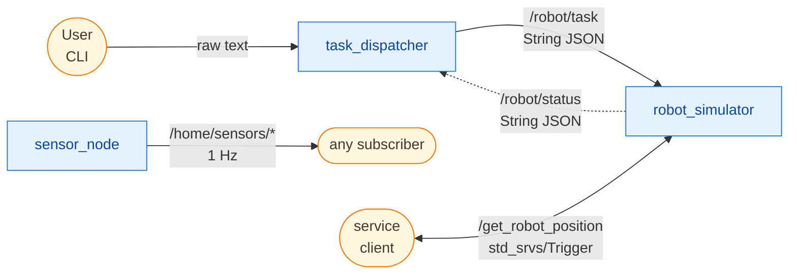
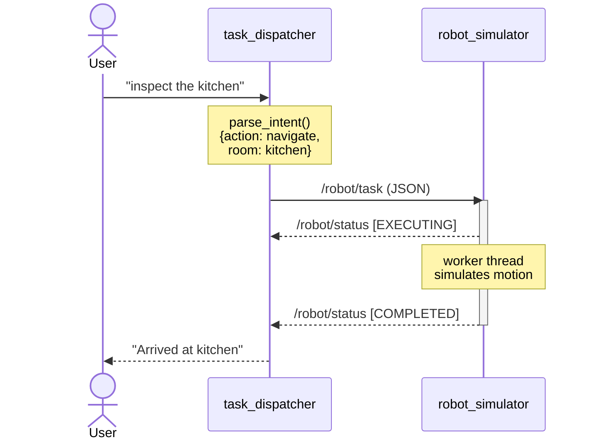

# homebot_dispatcher

A minimal Language-to-Robot proof of concept using ROS2 Humble.

A user types a natural language command. A dispatcher node parses
the intent and publishes a structured task to a ROS2 topic. A
simulated robot node subscribes, executes the task, and reports
status back. A sensor node streams fake IoT readings independently.

Built to explore ROS2 communication patterns — not to impress,
but to understand.

---

## Live demo

A full session captured from the running system. Three nodes are
launched, the dispatcher is invoked twice with natural language,
and a service call confirms the robot's final position.

```text
$ ros2 launch homebot homebot.launch.py
[INFO] [sensor_node]: SensorNode started - publishing 4 rooms at 1.0 Hz
[INFO] [robot_simulator]: RobotSimulator ready | starting room: charging_station

$ ros2 topic list
/home/sensors/bedroom
/home/sensors/hallway
/home/sensors/kitchen
/home/sensors/living_room
/parameter_events
/robot/status
/robot/task
/rosout

$ ros2 topic echo /home/sensors/kitchen --once
data: '{"room": "kitchen", "temperature_c": 21.9, "humidity_pct": 55.0, "timestamp_sec": 1779283857.81}'
---

$ ros2 run homebot task_dispatcher "check living room temperature"
[INFO] [task_dispatcher]: TaskDispatcher ready
[INFO] [task_dispatcher]: Dispatched -> action=sensor_query room=living_room
  [EXECUTING] Robot is at: charging_station
  [COMPLETED] Sensor check at living room complete.
              See /home/sensors/living_room for live readings.
              (now at: living_room)

$ ros2 run homebot task_dispatcher "go to charging station"
[INFO] [task_dispatcher]: TaskDispatcher ready
[INFO] [task_dispatcher]: Dispatched -> action=charge room=charging_station
  [EXECUTING] Robot is at: living_room
  [COMPLETED] Docked at charging station (now at: charging_station)

$ ros2 service call /get_robot_position std_srvs/srv/Trigger
response:
std_srvs.srv.Trigger_Response(success=True, message='charging_station')
```

The robot started in `charging_station`, moved to `living_room` for the
sensor query, then docked back to `charging_station` — and the service
call confirms it.

---

## Architecture

Three nodes, two topic families, one service. The dispatcher only
knows about language; the robot only knows about structured tasks.



### Message flow for one command



The robot's executor never blocks: the subscriber callback offloads
the `time.sleep`-based motion simulation onto a worker thread, so the
node stays responsive to new tasks and to service calls.

---

## ROS2 Concepts Demonstrated

| Concept            | Where used                                     | Why                                          |
| ------------------ | ---------------------------------------------- | -------------------------------------------- |
| Topics (pub/sub)   | `/robot/task`, `/robot/status`, `/home/sensors/*` | Async, decoupled communication            |
| Services           | `/get_robot_position`                          | Synchronous query needing a guaranteed reply |
| Parameters         | `config/params.yaml`                           | Runtime config without hardcoding            |
| Launch files       | `launch/homebot.launch.py`                     | Start all nodes with one command             |
| Threading in nodes | `robot_simulator.py`                           | Never block the ROS2 executor in a callback  |

---

## Requirements

- Ubuntu 22.04 (WSL2 is fine)
- ROS2 Humble
- Python 3.10+

## Quick Start

```bash
# Terminal 1 — launch infrastructure
source /opt/ros/humble/setup.bash
cd ~/homebot_ws && source install/setup.bash
ros2 launch homebot homebot.launch.py

# Terminal 2 — interactive dispatcher
source /opt/ros/humble/setup.bash
cd ~/homebot_ws && source install/setup.bash
ros2 run homebot task_dispatcher
```

## Example Commands

| Input                              | Action       | Room             |
| ---------------------------------- | ------------ | ---------------- |
| `inspect the kitchen`              | navigate     | kitchen          |
| `check living room temperature`    | sensor_query | living_room      |
| `go to charging station`           | charge       | charging_station |
| `patrol the hallway`               | navigate     | hallway          |

## Tests

```bash
cd ~/homebot_ws
pytest src/homebot/test/ -v
```

The intent parser has no ROS2 imports, so the tests run without
sourcing any ROS2 environment. That separation is intentional —
the language layer can be swapped (e.g. for a local LLM) without
touching the robotics layer.

## Limitations (honest notes)

- Intent parsing is rule-based regex; it is not robust to
  arbitrary phrasing.
- Robot motion is `time.sleep()`, not physics simulation.
- No coordinate system, no real map, no Nav2 integration.
- Sensor readings are randomly generated around per-room baselines.
- Task payloads use JSON-in-String rather than a custom `.msg` type
  (deliberate PoC scope choice).

## What I would add next

1. Replace the rule-based parser with a local LLM via Ollama
   (one function change in `intent_parser.py`, architecture unchanged).
2. Add a ROS2 action server for navigate tasks with real progress
   feedback (percentage complete, ETA).
3. Namespace topics for multi-robot support: `/robot_a/task`, etc.
4. Bridge `/home/sensors/*` to an MQTT broker so real IoT devices
   can publish into the system.
